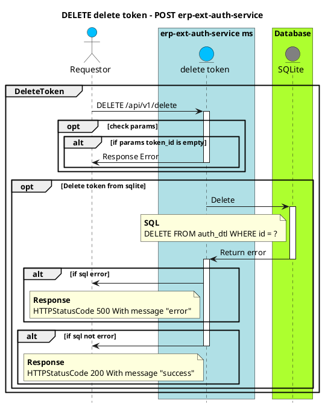

# Skeleton project

## 📋 Introduction

Standard project layout for every software.

## Sequence Diagram



## 🏁 Getting Started

##### 🛠️ Prerequisites

- GO version 1.21.1+ _<b>(required)</b>_
- Redis _<b>(required)</b>_
- Docker and docker-compose _<b>(optional)</b>_
- PlantUML for sequence diagram _<b>(optional)</b>_
- curl _<b>(optional)</b>_
- gosec _<b>(optional)</b>_
- govuln _<b>(optional)</b>_

##### 🏗️ Setup service

1. Clone repository.

```bash
# with ssh
git clone git@github.com:erpbwdev/erp-ext-auth-service.git

# with http (not recommanded)
git clone https://github.com/erpbwdev/erp-ext-auth-service.git
```

2. Install go dependencies.

```bash
# run with Makefile
make tidy

# or run with go cli
go mod tidy
```

## 📝 Usage

<b>How to run standalone service:</b>

```bash

# run with Makefile
make run

# run with go cli
export APPENV=local; go run -race app/cmd/*.go

```

<b>how to run service with docker container</b>

```bash
# run with Makefile
make up

# run with docker compose cli
docker-compose up -d
```

<b>Terminate service:</b>

```bash
# terminate docker container (Makefile)
make down

# terminate docker container (docker compose cli)
docker-compose down
```

<b>Makefile help list:</b>

```bash
make help
```

<b>Sequence diagram:</b>

1. Open vscode and then open uml script file in directory /docs
2. Display step:

```bash

# MacOS -> Press [opt + D]
# Windows -> Press [alt + D]
```

## ⚙️ Configuration

1. Non-sensitive config like `PORT`, `ENV` and etc. should be declare in config.yaml file
2. Sensitive config like `HOST`, `PASSWORD` and etc. should be declare in .env file

## 🧪 Testing

- Unit-test and coverage run this command:

```bash
# testing all _test.go files in this project.
make test

# test and show coverage use this command:
# this is example command pattern
# make cover-{topic}-{layer}

make cover-management-repo
# if you want to see make cli thats avaliable to use this command `make help`
```

- Integration test with `curl`:

```bash

# in directory /tools/curl-script has contains curl script
# for integration test with api endpoint
# Ex. in probe.http script
curl --location http://localhost:8998/health
```
