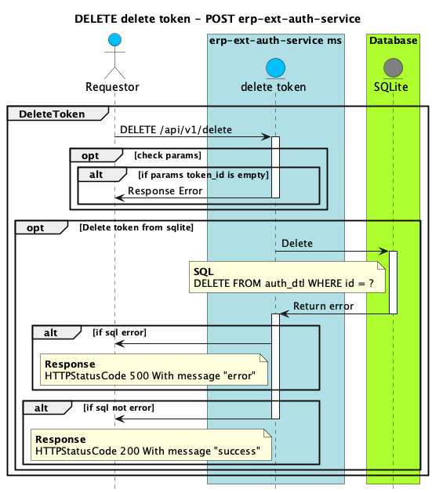

### Sequence Diagram

<br />



### Delete a New Question [DELETE]: /{namespace}/api/v1/delete

You may create your own question using this action. It takes a JSON object
containing a question and a collection of answers in the form of choices.

#### Request (application/json)

- Header

  | Key           | Savings                    |
  | ------------- | -------------------------- |
  | Content-Type  | application/json           |
  | Authorization | Bearer {your-access-token} |
  | Connection    | keep-alive                 |

- Body

  ```json
  {
    "question_id": "{question_id}"
  }
  ```

#### Response

````json
    // Success Case
    {
    "message": "success",
    "code": 1000
    }
    ```
````
